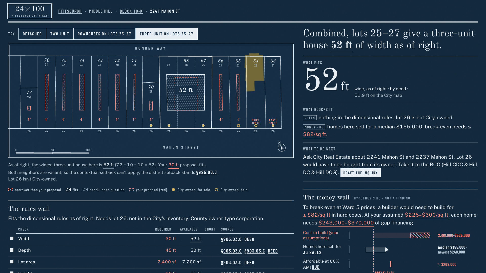

# 24×100

**What a Pittsburgh lot can hold, what's holding it back, and what would move it.**

Said "twenty-four by a hundred": the standard Pittsburgh lot, 24 ft wide and 100 ft deep, repeated in
every Mahon Street deed. Built for the AI for Housing Hackathon (AI Horizons 2026, Pittsburgh), Track 1:
Development Feasibility & Pro Forma Navigator.

> Pittsburgh is growing again, and housing costs are rising with it. 24×100 is for the people who get
> affordable homes built: housing nonprofits and CDCs, small and mid-size developers, municipal planners and
> policy analysts. It gives them a bird's-eye view of the City's vacant lots, lets them zoom into a single lot,
> and takes the manual hassle off their hands: pulling the datasets, reading the code, noticing what changed,
> drafting the letter. It never hides uncertainty. Whatever we don't know, it says so.



## The story in one lot

Since May 2025, **2241 Mahon St** (Middle Hill, lot 25 of Block 10‑K) meets the RM‑M minimum lot size
exactly: 2,400 sf (§903.03.C, Ord. 10‑2025). A two-unit house still gets **4 ft** of width: 24 − 10 − 10 = 4,
because RM needs 10 ft side setbacks and both neighbors are vacant, so the contextual setback can't apply
(§925.06.C). Every lot down the street shows the same red sliver. Combine lots 25–27 and a three-unit house
gets **52 ft** (72 − 10 − 10), but lot 26 isn't City-owned. Then money, which a developer checks first: a
practitioner at the hackathon put vertical construction at $325–$375 per sq ft, so each 1,350 sq ft home costs
at least $438,750 to build before site work, land, soft costs or financing. Homes in Ward 5 sold for a median
**$155,000** (not an appraisal); the newest new build sold for $240,000; an 80% AMI household could afford about
$268,000. The gap is **at least $170,000 per home**: "Only with subsidy (screening estimate)". Checking money
first is the cheapest order to learn things in; which barrier blocks more often is unproven.

## What it does

- **City → block → lot.** The first screen maps every City-owned vacant lot, colored by what blocks it for
  the building you choose. Districts whose rules haven't been checked stay grey: "rules not loaded". Never a
  guess.
- **What fits · What blocks it · What to do next** for any lot on a loaded block, with a plate drawn from the
  City's parcel polygons: every lot's buildable envelope, edge labels, ownership coins. No score: a verdict in
  words ("Can't tell yet", "Only with subsidy", "Doesn't fit as of right", "Worth a closer look, if …") with
  three chips, Money · Rules · Site.
- **Four panels, in the order a developer checks them.** Money (vertical construction at a practitioner's
  estimate against three labelled value signals; the gap as a lower bound), Rules (a ledger: required ·
  available · short · source, and the specific relief), Site (soil, environmental, water and sewer: not assessed,
  with the free signal and what resolves each), and What to check next, cheapest first.
- **AI reads the code; people decide.** A model (Gemini by default, Claude optional, through LangChain)
  proposes typed rules from the saved code text, each tied to a verbatim quote. They stay pencil until a named
  person signs them. Ambiguous clauses become questions for the City; an assumed answer is red, never ink.
- **The letter.** A one-page inquiry to City Real Estate, the Zoning Administrator, the RCO and the URA, built
  only from engine facts. Every number is checked against the engine before you can copy it. It is a draft;
  nothing is ever sent for you.
- **It keeps watching.** `npm run refresh` re-pulls every dataset and shows what changed in pencil. A static
  JSON API serves every lot. An optional watchlist digest (Slack or email) is off by default and previews as a
  dry run.

## Run it

```bash
npm install && uv sync
npm run dev            # http://localhost:5173
```

| Command | What it does |
|---|---|
| `npm test` | Engine tests (vitest) and pipeline/extraction tests (pytest) |
| `npm run build` | Static API (`api/lots/<pin>.json`, `api/blocks/<id>.json`) and the site in `web/dist` |
| `npm run rebuild` | Everything from raw public data: pull → join → reconcile → rules → engine → API → site |
| `npm run refresh` | Re-pull every dataset and write the differences (shown in pencil in the app) |
| `npm run digest -- --dry-run` | Preview the watchlist digest without sending it |
| `uv run python -m extract run --district R1D-H` | Live rule extraction for a district (needs `GOOGLE_API_KEY` in `.env`) |
| `npm run shoot` | Screenshots of every storyboard state (1440 and 390 px, light and dark) |
| `npm run demo -- --record` | One 1920×1080 clip per storyboard beat in `film/clips/` |

Deep links reproduce every state: `?view=lot&block=10K&lot=25&type=two`,
`?view=lot&block=10K&lot=25&type=three&lots=25,26,27`, `?view=review&district=R1D-H`,
`?view=inquiry&block=10K&lot=25&type=three&lots=25,26,27`. Add `&present=1` for a projector or `&record=1` for
a fixed 1920×1080 recording stage. `STORYBOARD.md` lists all twelve beats.

## Data sources

All public, pulled 26 Sep 2026; each output file records its pull time, URL and hash.

| Source | Used for |
|---|---|
| City of Pittsburgh ArcGIS: PGHParcels, residential lot dimensions (Feb 2025), building footprints (2023), zoning, zoning overlays, 25%+ slope, undermined areas | Parcel geometry, zoning, RCO overlay, slope and undermining |
| WPRDC Allegheny County property assessments | Lot area, use, year built, exterior finish, legal description (deed dimensions), owner **category** only |
| WPRDC City-Owned Properties | City ownership, sale status and when it was last updated, addresses |
| WPRDC Allegheny County real-estate sales (CC0) | Ward 5 comparable sales |
| HUD FY2026 income limits (Section 8 workbook) | 80% AMI for the Pittsburgh HMFA |
| WPRDC historic zoning maps (1927, 1958, 1967) | The block's history |
| OpenStreetMap (Overpass) | Street names and centerlines |
| Pittsburgh Code, Title 9, chapters 903, 906, 911, 914, 915, 921, 925 (ecode360, saved 26 Sep 2026) | The only input to rule extraction |

No personal data: owner names and mailing addresses are never requested or stored, and a test greps every
output for them.

## AI disclosure

- **The code was written largely by a Claude Opus 5.5 coding agent (Anthropic), directed by the team**, who set
  the goals, the rules of evidence and the product decisions, and review the work. Helper agents built parts of
  the pipeline, extraction and interface under the same rules.
- **At runtime, rule extraction uses a large language model through LangChain**: Google Gemini by default
  (`gemini-3.8-flash`, free tier) and Anthropic Claude as a drop-in alternative (`EXTRACT_PROVIDER=anthropic`).
  Only public zoning-code text is sent; never parcel records or anything personal. On Gemini's free tier,
  prompts may be used to improve Google's products.
- The model never computes a setback, adds a fact to the inquiry or decides an interpretation. It proposes
  typed rules with verbatim quotes; code checks the quotes; a named person signs or strikes each rule.
- The RM‑M dimensional rules were matched to the saved code text by an AI research pass and are labeled that
  way in the app ("AI-checked · needs a teammate"). None is City-confirmed.

## Evaluation

| What | Result | Where |
|---|---|---|
| Rule extraction, RM‑M, against the answer key (values checked by a person against the saved code text) | **11 of 11 fields agree**; 21 of 21 quotes verbatim inside their cited sections; the model flagged the "single-unit house" ambiguity itself (`gemini-3.8-flash`) | `docs/eval.md` |
| Held-out district nobody typed: R1D‑H (Larimer) | 21 rules proposed, 0 rejected by the guards, all pencil until a person signs them (`gemini-3.6-flash`: the free tier's daily limit refused 3.8) | `data/rules/extracted/r1d-h.json` |
| Claude as the extraction model | Built and tested for shape; **not run** (no key) | `docs/eval.md` |
| Cost to extract one district | $0.06–$0.16 at paid rates, from real token logs; $0 on the free tier | `docs/pilot.md` |
| Engine tests (vitest) | 122 pass, including the spec's expected values, formula round-trips, no double counting, trust states and a **mutation check** (side setback 10 → 5 makes the width test fail) | `engine/test/` |
| Pipeline and extraction tests (pytest) | 133 pass, 0 skipped: reconciliation, LEGAL1 parsing, comparables reproduction, determinism, privacy grep, quote guards | `pipeline/tests/`, `extract/tests/` |
| No personal data | A test walks every output (blocks, money, city, refresh, digest) for owner-name and mailing fields | `pipeline/tests/test_privacy.py` |
| Trust states in the rendered DOM | No pencil, struck or unsigned † item is drawn in ink; inquiry facts are ink only; a planted violation is caught | `scripts/trust-scan.mjs` |
| No score anywhere (spec §0.12) | None in the UI, the letter, `film/facts.json` or the film notes; a planted score is caught | `scripts/no-score.mjs` |
| First run: "what blocks 2241 Mahon St, and what would unlock it?" | 3 actions from the home page (search, type, Enter) on desktop and phone; a scripted path, not a study with people | `docs/evidence/first-run.json` |
| Citywide number | RM‑M, 984 City-owned vacant lots, 563 computable: a two-unit house is too narrow on 480 and under the minimum area on 311 | `docs/evidence/problem.md` |

## Limitations

The City of Pittsburgh interprets its own code; 24×100 is decision support, not legal, financial or zoning
advice. Parcel geometry comes from GIS, not surveys; lot areas are checked against deeds and conflicts are
shown, not settled. Water and sewer capacity, soils, fill, title and liens are not assessed. Footprints come
from a 2023 layer. The slope layer is a derived threshold, not the steep-slope overlay. Community priorities
are not scored; 24×100 points to the RCO. There is no score. The money screen is an estimate: one
practitioner's construction cost and a gap that is a lower bound. Full list: `docs/limitations.md`.

## Built with

TypeScript, React 19, Vite 8, polygon-clipping, Vitest, Playwright; Python 3.12 with requests, shapely,
openpyxl, pydantic, LangChain (`langchain-google-genai`, `langchain-anthropic`), pytest. Type: Old Standard TT,
Public Sans, Barlow Condensed (Google Fonts).
