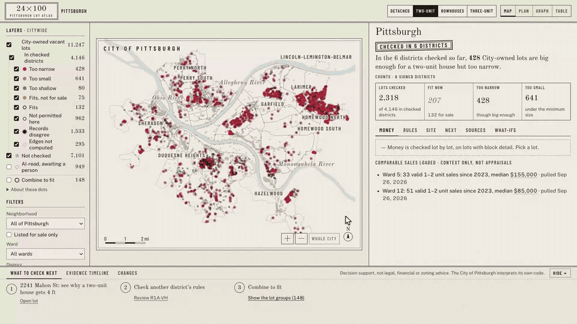
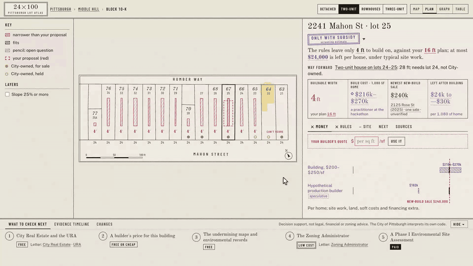

# 24×100

[](https://github.com/LeeSinLiang/24x100/actions/workflows/ci.yml)

**What a Pittsburgh lot can hold, what's holding it back, and what would move it.**

Said "twenty-four by a hundred": the standard Pittsburgh lot, 24 ft wide and 100 ft deep, repeated in
every Mahon Street deed. Built for the AI for Housing Hackathon (AI Horizons 2026, Pittsburgh), Track 1:
Development Feasibility & Pro Forma Navigator.

**Demo video:** _[PLACEHOLDER: the video link goes here]_

**Live demo:** [24x100.vercel.app](https://24x100.vercel.app/)

[](https://24x100.vercel.app/)

_Uncut screen recording (sped up 1.5×): map → lot → Development Ease → evidence graph → the Slack/email digest preview._

> Pittsburgh is growing again, and housing costs are rising with it. 24×100 is for the people who get
> affordable homes built: housing nonprofits and CDCs, small and mid-size developers, municipal planners and
> policy analysts. It gives them a bird's-eye view of the City's vacant lots, lets them zoom into a single lot,
> and takes the manual hassle off their hands: pulling the datasets, reading the code, noticing what changed,
> drafting the letter. It never hides uncertainty. Whatever we don't know, it says so.



## Judge's 3-minute tour

Five links into the app, in the order the story goes. To run it locally instead, replace
`https://24x100.vercel.app/` with `http://localhost:5173/` after `npm install && npm run dev`.

1. **One lot: [2241 Mahon St, a two-unit house](https://24x100.vercel.app/?view=lot&block=10K&lot=25&type=two).**
   It meets the minimum lot size exactly, and the side setbacks still leave 4 ft to build on. So does every lot
   down the street. Its Development Ease reads 0–40 out of 100; click the bar for the six parts behind it.
2. **Combine it, then money first: [lots 25–27, a three-unit house, Money tab](https://24x100.vercel.app/?view=lot&block=10K&lot=25&type=three&lots=25,26,27&tab=money).**
   52 ft to build on; building costs more than the newest new-build sale: "Only with subsidy", a screening
   estimate that says whose.
3. **Your builder's quote: [the same lots at $140 per sq ft](https://24x100.vercel.app/?view=lot&block=10K&lot=25&type=three&lots=25,26,27&tab=money&quote=140).**
   The money follows your number, in red (yours, not checked), beside the practitioner's estimate: at full cost a
   home still needs $23.1k–$48.1k of subsidy before land, so the stamp stays "Only with subsidy".
4. **Which sentence to change: [Rule what-ifs, S1](https://24x100.vercel.app/?view=city&type=two&tab=whatif&whatif=S1).**
   Strike one sentence of §925.06.C and 196 more City lots could hold a two-unit home. A what-if, not the law.
5. **Combine to fit: [lot groups in RM‑M](https://24x100.vercel.app/?view=city&type=three&layer=assemble&canvas=table).**
   111 groups of 2–3 side-by-side lots, with room for up to 240 homes.

Also worth a click: **[Compare sites](https://24x100.vercel.app/?view=compare&cols=10K:25:two;10K:25,26,27:three:140;0124N00247000000:two)**
(the same Development Ease columns side by side, each with its own cost basis; change any column by parcel ID or
address), **[Tonight's shortlist](https://24x100.vercel.app/?view=shortlist)**, **Graph** on any lot (every node a real
record, down to who signed each rule), **Watch this lot** on the Next tab (what the Slack and email digest will
send), and **Draft the letter** (one per office, every number traced to the engine). On a phone, the same links work.

## Who it's for

The four people Track 1 names, each with a way in from the home page (Start here):

| Who | Their first question | Where it opens |
|---|---|---|
| **Nonprofit / CDC** | Which City lots could we build on, and what subsidy would a home need? | [Tonight's shortlist](https://24x100.vercel.app/?view=shortlist), then a lot's money at full cost |
| **Developer** | For this parcel: how easy, and does my builder's price work? | A parcel's [Development Ease and quote](https://24x100.vercel.app/?view=lot&block=10K&lot=25&type=three&lots=25,26,27&tab=ease); search by parcel ID or address |
| **Planner** | Where does what block building, and how do sites compare? | The city map by first blocker, and [compare sites](https://24x100.vercel.app/?view=compare) (any site, by parcel ID or address) |
| **Policy analyst** | Which sentence of the code blocks the most, and what would changing it open? | [Rule what-ifs](https://24x100.vercel.app/?view=city&type=two&tab=whatif&whatif=S1) and the policy agent's questions |

## Development Ease

A range out of 100, never a lone number (`engine/src/ease.ts`). Six parts, each clear, blocks or unknown, with its
source or who to ask: **zoning fit** (variances), **approvals needed** (special exceptions, grading review, parking
relief), **ownership and assembly** (a City sale, another owner, consolidation), **site** (share of the lot mapped at
≥25% slope; overlap with mapped mines), **water and sewer** (not modelled: always unknown, ask PWSA) and **money at
full cost**. It starts at 100; a known step takes its weight off both ends, an unknown only off the low end, so an
unknown never makes a lot look easier. A fit or a shortfall that rests on pencil (mapped lines without deed
dimensions, a neighbour's setback that could change it, records on both sides of the minimum) or on your own
assumption counts as unknown, never "fits as of right". A lot with four of its five assessable parts unknown, or
one the records refuse, says "can't score yet". The weights are ours and printed with every result: variance 35,
use variance 35, special exception 20, grading review 20, administrator exception 10, parking relief 10, another
owner 15, City sale 5, consolidation 5; steep ground 15, mapped mines 20, water and sewer 20, a subsidy gap 20;
approvals the map can't assess on a lot without block detail 20. Lot 25 alone reads 0–40; lots 25–27 read 0–60
(at the estimate and at a $140 quote); 156 Meadow St (tonight's shortlist) reads 35–95. On the shortlist, 34 of the
42 are scored and 8 say "can't score yet": their fit rests on mapped lines. [Compare sites on the same
columns](https://24x100.vercel.app/?view=compare), each with its own building type and builder's quote
(`cols=10K:25,26,27:three:140;<PIN>:two`), and change any column by parcel ID or address; every lot's Ease tab links
there.

## The agents

One goal in, a team of agents works the lot, and a person holds every gate. The engine computes every number; a
model only plans, picks checks and drafts words, and a verifier checks every number, quote and source before a case
file is published.

| Agent | What it does | Re-run |
|---|---|---|
| **Steward** | Reads the engine's answer for the lot, plans, dispatches the others, collects the drafts and gates (a LangGraph graph) | `npm run steward -- 0010K00025000000 --goal two` |
| **Due diligence** | The free public checks: PLI permits and violations, condemnations, tax liens, 311, the undermining and slope layers, each with its URL, pull time and sha256; paid studies drafted, never done | (in the steward's run) |
| **Policy** | Asked by the steward when a rule is the first blocker: finds the sentence, writes the redline, counts the change citywide, drafts a memo | `uv run python -m agents.policy "What if …?" --building two` |
| **Watch** | When a watched lot's answer changes: the before and after with the math, and the next move drafted; a simulation is labelled | `npm run agents -- watch --baseline d87dce4^` |
| **Shortlist** | Every night, due diligence over all 11,247 City-owned vacant lots (about 100 requests, no model, $0), and the lots where a two-unit house fits today that passed the zoning and records checks (site conditions and money still need review): [Tonight's shortlist](https://24x100.vercel.app/?view=shortlist) | `npm run shortlist` |
| **Verifier** | Blocks publication on a quote not word for word in the saved code, a number the engine or a source doesn't hold, a garbled word a model copied, a finding without a source, or a name-like field | (last in every run) |

Three gates wait for a person: **send** (every letter and memo), **spend** (every paid study) and **sign** (every
rule still in pencil). Nothing is sent, paid for or signed by an agent. See [lot 25's case file](https://24x100.vercel.app/?view=case&pin=0010K00025000000),
[the watch run](https://24x100.vercel.app/?view=case&pin=watch) and [the policy agent's Q1](https://24x100.vercel.app/?view=city&type=two&tab=whatif&whatif=Q1).
The model is `gemini-3.5-flash-lite` (and the policy agent's free-model fallback) on the free tier of a team
member's Google key, loaded at run time and never stored; without a key the steward runs by a fixed plan and says so.

## The story in one lot

Since May 2025, **2241 Mahon St** (Middle Hill, lot 25 of Block 10‑K) meets the RM‑M minimum lot size
exactly: 2,400 sf (§903.03.C, Ord. 10‑2025). A two-unit house still gets **4 ft** of width: 24 − 10 − 10 = 4,
because RM needs 10 ft side setbacks and both neighbors are vacant, so the contextual setback can't apply
(§925.06.C). Every lot down the street shows the same red sliver. Combine lots 25–27 and a three-unit house
gets **52 ft** (72 − 10 − 10), but lot 26 isn't City-owned. Then money, which a developer checks first: a
practitioner at the hackathon put vertical construction for City single-family infill at $200–$250 per sq ft
("varies a lot with builder size"), so each 1,350 sq ft home costs **$270,000–$337,500** to build. The newest new
build in Ward 5 sold for $240,000 (one sale, not an appraisal), so **nothing is left** for site work, soft costs
and land: building alone costs more. The same practitioner's speculative production-builder case ($150/sq ft)
would leave $37,500, about what site work alone may take ($25,000–$50,000 typical, another practitioner; not a
cap). Verdict: "Only with subsidy (screening estimate)". Checking money first is the cheapest order to learn
things in; which barrier blocks more often is unproven.

## What it does

- **One screen.** A workspace: search, the building type and **Map · Plan · Graph · Table** across the top;
  layers and filters on the left; the canvas in the middle; an inspector on the right that follows what you
  pick (a status and its Development Ease range, one plain sentence, four numbers, then Money · Ease · Rules · Site ·
  Next · Sources); and a tray at
  the bottom with what to check next, an evidence timeline and what changed. Light (paper) by default, dark
  (cyanotype) on a toggle.
- **City → block → lot.** The Map shows every City-owned vacant lot, colored by what blocks it for the building
  you choose. Districts whose rules haven't been checked stay grey: "rules not loaded". Never a guess. Pick a lot
  and its plan appears in an inset joined to its dot.
- **The Plan** is drawn from the City's parcel polygons: every lot's buildable envelope, edge labels, ownership
  coins. A verdict in words ("Can't tell yet", "Only with subsidy", "Doesn't fit as of right",
  "Worth a closer look, if …") with three chips, Money · Rules · Site, and beside it the Development Ease range.
- **Money at full cost.** The headline is the subsidy a home needs before land: building × (1 + soft costs +
  financing) + site work − the newest new-build sale. At your $140/sf builder's quote on lots 25–27 that is
  $23.1k–$48.1k a home; the $51k "left after building only" stays on its tile, labelled as the intermediate it is.
- **The Graph** links the lot to the rules that constrain it (each with its verbatim quote and who signed it),
  the datasets behind it (with pull times), the cost estimates and the sale, the site checks and the offices
  to write to. Every node is a real record.
- **Combine to fit.** Across the city, which City-owned lots fit as of right when combined with the vacant lots
  beside them on the same block face, and what kind of owner holds each missing piece (owner type, never names).
- **Rule what-ifs: which sentence of the code blocks the most City land?** The citywide classifier runs again with
  one clause read differently. Strike the last sentence of §925.06.C ("If lots on either side of the subject lot
  are vacant, the setback that is required by the zoning district shall apply.") and **196 more City-owned lots
  could hold a two-unit house**. Extending the narrow-lot table to two- and three-unit houses opens 325, mostly
  pencil because an open question (§925.06.C.1) still decides them. RM's 10 ft side setback at 5 ft opens 36.
  - The page quotes each sentence, struck through, counts the lots and lights them on the map in pencil.
  - A what-if, not the law: a rule change needs City Council.
- **AI reads the code; people decide.** A model (Gemini by default, Claude optional, through LangChain)
  proposes typed rules from the saved code text, each tied to a verbatim quote. Code then re-reads each value
  from the code's tables by position, with no model. The rules stay pencil until a named person signs them.
  Ambiguous clauses become questions for the City; an assumed answer is red, never ink. Four more districts
  (R2‑L, R1D‑L, R2‑H, R1D‑M) were proposed by the model, checked by the agent, and signed off by Sin on that check:
  six districts are computed.
- **Your builder's quote.** Type the $/sq ft a builder quoted on the Money tab (or `&quote=140` in the link). The
  gap, what's left and the verdict follow it, in red (yours, not checked), beside the practitioner's estimate;
  the URA letter says "Our builder quoted $140 per sq ft (not verified)".
- **The letters.** One short draft per office (City Real Estate, the Zoning Administrator, the URA, the RCO, and
  the County when records disagree), each with only what that office needs, built from engine facts. Every
  number is checked against the engine before you can copy it. Nothing is ever sent for you.
- **It keeps watching.** `npm run refresh` re-pulls every dataset and shows what changed in pencil. A static
  JSON API serves every lot. An optional watchlist digest (Slack or email) is off by default and previews as a
  dry run.
- **A team of agents works a lot, and a person holds the gates.** `npm run steward -- <pin> --goal two` runs a
  steward (a LangGraph graph) that reads the engine's answer, plans, and dispatches: due diligence (PLI permits and
  violations, condemnations, tax liens, 311 and the undermining and slope layers, each a finding with its URL, pull
  time and sha256; paid studies drafted, never marked done), the what-ifs, the engine's letters, and a verifier that
  blocks publication on a quote not verbatim in the code, a number the engine or a source doesn't hold, a finding
  without a source, or a name-like field. A watch agent explains a watched lot's change with its math and drafts the
  next move; a simulation ("if lot 24 got a building permit") is computed by the engine and labelled. Every letter,
  paid study and unsigned rule waits at a gate. [Lot 25's case file](https://24x100.vercel.app/?view=case&pin=0010K00025000000),
  [the watch run](https://24x100.vercel.app/?view=case&pin=watch).

## Run it

On a fresh machine (macOS or Linux; on Windows use WSL or Git Bash), with [Node.js](https://nodejs.org) 22.12+ and
[uv](https://docs.astral.sh/uv/) installed:

```bash
git clone https://github.com/LeeSinLiang/24x100.git && cd 24x100
./scripts/setup.sh     # checks the tools, installs from the lockfiles, creates .env, runs the tests (~40 s)
npm run dev            # http://localhost:5173
```

The site, the tests and the build need no keys. `scripts/setup.sh` creates `.env` from `.env.example` (never
overwriting one) and offers to save a `GOOGLE_API_KEY`, read silently. Every key is optional:

| Key in `.env` | Unlocks |
|---|---|
| `GOOGLE_API_KEY` | Rule extraction (`uv run python -m extract run --district R1D-H`) and the agents' model; without it the agents run by a fixed plan (`--no-model`) |
| `ANTHROPIC_API_KEY` | Claude instead of Gemini for extraction (`EXTRACT_PROVIDER=anthropic`) |
| `SLACK_WEBHOOK_URL`; `RESEND_API_KEY` + `DIGEST_TO`, or `SMTP_*` | Sending the watchlist digest (`npm run digest -- --send`); `--dry-run` needs none |

Chrome is needed only for the page checks (`npm run smoke`, `scripts/words.mjs`, `npm run demo`). By hand instead
of the script: `npm ci && uv sync && cp .env.example .env`.

| Command | What it does |
|---|---|
| `npm test` | Engine tests (vitest) and pipeline/extraction tests (pytest) |
| `npm run build` | Static API (`api/lots/<pin>.json`, `api/blocks/<id>.json`) and the site in `web/dist` |
| `npm run smoke -- <url>` | After a deploy: the film's numbers (6 districts, 428, 196), the $140 quote's gap ($23.1k–$48.1k), the letters, the API and no console errors, in Chrome (default `http://localhost:4173/`, `npm run preview`) |
| `npm run rebuild` | Everything from raw public data: pull → join → reconcile → rules → engine → API → site |
| `npm run refresh` | Re-pull every dataset and write the differences (shown in pencil in the app) |
| `npm run digest -- --dry-run` | Preview the watchlist digest without sending it |
| `npm run shortlist` | Tonight's shortlist: every City lot re-checked against the public records (`data/shortlist/`, `?view=shortlist`); nightly with the digest |
| `npm run steward -- <pin> --goal two` | The agents' case file for a lot (`data/cases/<pin>.json`, `?view=case&pin=<pin>`); `--no-model` plans by rule |
| `npm run agents -- watch --baseline <ref> [--simulate <pin>:<built pin>]` | The watch agent: what changed on the watchlist, explained, the next move drafted |
| `uv run python -m extract run --district R1D-H` | Live rule extraction for a district (needs `GOOGLE_API_KEY` in `.env`) |
| `npm run og` | The link-preview image (`web/public/og.png`, 1200×630) and favicons, drawn from the running app |
| `npm run shoot` | Screenshots of every storyboard state (1440 and 390 px, light and dark) |
| `npm run demo -- --record` | One 1920×1080 clip per storyboard beat in `film/clips/` |
| `npx tsx scripts/build-scenarios.ts` | The rule what-ifs (`data/city/scenarios.json`); also part of `npm run build` |
| `uv run python -m extract rulecheck --district R2-L` | The agent's check of a district's proposed rules, for a person to sign off on |

Deep links reproduce every state: `?view=lot&block=10K&lot=25&type=two`,
`?view=lot&block=10K&lot=25&type=three&lots=25,26,27` (add `&canvas=map`, `graph` or `table`),
`?view=city&type=three&layer=assemble`, `?view=review&district=R1D-H`,
`?view=inquiry&block=10K&lot=25&type=three&lots=25,26,27`. Add `&theme=dark`, `&present=1` for a projector or
`&record=1` for a fixed 1920×1080 recording stage. `STORYBOARD.md` lists the beats.

## Data sources

All public, pulled 26 Sep 2026 unless noted; each output file records its pull time, URL and hash.

| Source | Used for |
|---|---|
| City of Pittsburgh ArcGIS: PGHParcels, residential lot dimensions (Feb 2025), building footprints (2023), zoning, zoning overlays, 25%+ slope, undermined areas | Parcel geometry, zoning, RCO overlay, slope and undermining |
| WPRDC Allegheny County property assessments | Lot area, use, year built, exterior finish, legal description (deed dimensions), owner **category** only |
| WPRDC City-Owned Properties | City ownership, sale status and when it was last updated, addresses |
| WPRDC Allegheny County real-estate sales (CC0) | Ward 5 and Ward 12 comparable sales |
| WPRDC [PLI Permits](https://data.wprdc.org/dataset/pli-permits), [PLI/DOMI/ES Violations](https://data.wprdc.org/dataset/pittsburgh-pli-violations-report), [Condemned and Dead-End Properties](https://data.wprdc.org/dataset/condemned-properties) (City of Pittsburgh) | Due diligence and tonight's shortlist (pulled 27 Sep 2026) |
| WPRDC [Allegheny County Tax Liens](https://data.wprdc.org/dataset/allegheny-county-tax-liens-filed-and-satisfied), [Pittsburgh 311 requests](https://data.wprdc.org/dataset/pittsburgh-311-data) | Due diligence and tonight's shortlist: lien status (no assignee), 311 counts nearby (no case owner) |
| HUD FY2026 income limits (Section 8 workbook) | 80% AMI for the Pittsburgh HMFA |
| WPRDC historic zoning maps (1927, 1958, 1967) | The block's history |
| OpenStreetMap (Overpass) | Street names and centerlines |
| Pittsburgh Code, Title 9, chapters 903, 906, 911, 914, 915, 921, 925 (ecode360, saved 26 Sep 2026) | The only input to rule extraction |

No personal data: owner names and mailing addresses are never requested or stored, and a test greps every
output for them.

## AI disclosure

- **The code was written largely by a Claude Opus 5.5 coding agent (Anthropic), directed by the team**, who set
  the goals, the rules of evidence and the product decisions, and review the work. Helper agents built parts of
  the pipeline, extraction and interface under the same rules.
- **At runtime, rule extraction uses a large language model through LangChain**: Google Gemini by default
  (`gemini-3.8-flash`, free tier) and Anthropic Claude as a drop-in alternative (`EXTRACT_PROVIDER=anthropic`).
  Only public zoning-code text is sent; never parcel records or anything personal. On Gemini's free tier,
  prompts may be used to improve Google's products.
- The model never computes a setback, adds a fact to the inquiry or decides an interpretation. It proposes
  typed rules with verbatim quotes; code checks the quotes; a named person signs or strikes each rule.
- **The agents** (`agents/`) use a model only to plan, pick checks and draft words (`gemini-3.5-flash-lite`,
  through `gemini-flash-lite-latest`, on the free tier of a team member's Google key). The engine computes every
  number; the verifier checks every number a model wrote against the numbers it was given (that each is there, not
  what it means) and every quote verbatim against its source, and blocked real runs where the model garbled "24×100". Model-written words are shown in pencil: no person has read them. With no model the same run
  goes by a fixed plan and says so. Due diligence requests only whitelisted fields, so no owner name, contractor,
  lien assignee or 311 case owner is ever fetched.
- The RM‑M dimensional rules were first matched to the saved code text by an AI research pass. The agent then
  checked the 20 rules the Mahon Street and Larimer results use (every quote verbatim in its cited section, every
  value matching its quote: [`docs/reviews/rule-check-for-sin.md`](docs/reviews/rule-check-for-sin.md)), and Sin
  (team 24×100) signed off on that check. On 27 Sep Sin signed off the same way on the agent's check of 48
  more rules in four districts ([`docs/reviews/rule-check-coverage.md`](docs/reviews/rule-check-coverage.md)). The app records exactly that: "Signed off on the agent's 20-rule check".
  A person took responsibility for the agent's check; they did not re-read each quote. None is City-confirmed.

## Evaluation

| What | Result | Where |
|---|---|---|
| Rule extraction, RM‑M, against the answer key from the team's research notes (checked against the code text by a person on the team; in this app matched to the saved text by an AI research pass, then signed off by Sin on the agent's [20-rule check](docs/reviews/rule-check-for-sin.md)) | **11 of 11 fields agree**; 21 of 21 quotes verbatim inside their cited sections; the model flagged the "single-unit house" ambiguity itself (`gemini-3.8-flash`) | `docs/eval.md` |
| Four more districts (27 Sep): R2‑L, R1D‑L, R2‑H, R1D‑M | 48 rules proposed, 0 rejected; every value read again by position from the §903.03 and §911.02 tables with no model, 0 disagree. Signed off by Sin on the agent's check (27 Sep), so they are computed (`gemini-3.6-flash`: 3.8 was overloaded; the free tier's daily limit stopped the run before H and P) | [`docs/reviews/rule-check-coverage.md`](docs/reviews/rule-check-coverage.md) |
| Coverage run 2 (27 Sep afternoon, free tier, `gemini-3.5-flash`) | R1A‑H read in full (12 rules, 0 rejected); R1A‑VH and R1A‑M in part (7 and 8 rules; the use-table call was refused, 503 then 429, and R1A‑VH has no minimum lot area), so their 479 lots stay grey. The daily quota stopped the run before the other 27 districts. 21 min 55 s wall (20 min of it waiting out 503s), 148 s of model time, 7,663 tokens in and 26,013 out: $0.25 at the paid rate, $0 on the free tier. Pencil, never counted | `data/rules/extracted/r1a-*.json` |
| Held-out district nobody typed: R1D‑H (Larimer) | 21 rules proposed, 0 rejected by the guards; the 11 the Larimer lot uses were signed off by Sin on the agent's check, the other 10 stay pencil (`gemini-3.6-flash`: the free tier's daily limit refused 3.8) | `data/rules/extracted/r1d-h.json` |
| Claude as the extraction model | Built and tested for shape; **not run** (no key) | `docs/eval.md` |
| Cost to extract one district | $0.06–$0.16 at paid rates, from real token logs; $0 on the free tier | `docs/pilot.md` |
| Engine tests (vitest) | 235 pass, including the spec's expected values, formula round-trips, no double counting, trust states and a **mutation check** (side setback 10 → 5 makes the width test fail) | `engine/test/` |
| Rule what-ifs | The published summary (428 two-unit, 220 three-unit) reproduced exactly with no override; lot 25 at 18 ft under S1 and S2; a scenario without its override opens nothing; disabling S1 in the engine fails the tests | `engine/test/scenarios.test.ts` |
| Pipeline and extraction tests (pytest) | 192 pass, 0 skipped, on a machine with the raw pulls. On a clean checkout (the GitHub CI run) 181 pass and 8 skip, each saying why: they need `data/raw` or the citywide work files, which are gitignored on purpose and rebuilt by `npm run rebuild` (`data/raw` is 558 MB of raw public pulls, and the County assessment pulls in it carry owner-name fields the pipeline drops, so it is never committed); the privacy walk also has 3 fewer files to walk (the three gitignored work files in `data/city/work/`). Reproduced on a fresh local clone after `npm ci`: the same 181 + 8. Covered: reconciliation, LEGAL1 parsing, comparables reproduction, determinism, privacy grep, quote guards, use-table cells read by position | `pipeline/tests/`, `extract/tests/` |
| No personal data | A test walks every output (blocks, money, city, refresh, digest) for owner-name and mailing fields | `pipeline/tests/test_privacy.py` |
| CI (`.github/workflows/ci.yml`) | The deterministic checks: typecheck, vitest, pytest, the build reproduces every committed data file byte for byte, the ease guard and the trust scan. Green on GitHub (ubuntu-latest) for every push since the repository went public (27 Sep). The word budgets and the smoke test run locally and after a deploy, not in CI | `.github/workflows/ci.yml` |
| Post-deploy smoke test (by hand: `npm run smoke -- <url>`) | 16 of 16 pass on [24x100.vercel.app](https://24x100.vercel.app/) (27 Sep): 16 checks (6 districts, 428, 196, lot 25's 4 ft, the $140 quote's $23.1k–$48.1k gap and $51k left after building, the letters, the API, the preview image, a phone, no console errors); `--mutate` nudges every expected value and all 9 value checks fail | `scripts/smoke.mjs` |
| Trust states in the rendered DOM | No pencil, struck or unsigned † item is drawn in ink; inquiry facts are ink only; a planted violation is caught | `scripts/trust-scan.mjs` |
| Development Ease is never a lone number | Every ease on screen is a range with its parts one click away, never a bare "NN / 100"; a planted bare score is caught (the guard replaced the no-score check when the team chose to show the score) | `scripts/ease-guard.mjs` |
| First run: "what blocks 2241 Mahon St, and what would unlock it?" | 3 actions from the home page (search, type, Enter) on desktop and phone for the blocker and a way forward; the reason (the 10 ft side setbacks) is one more click, on the Rules tab. A scripted path, not a study with people | `docs/evidence/first-run.json` |
| Citywide number | Six districts computed (RM‑M, R1D‑H, R2‑L, R1D‑L, R2‑H, R1D‑M), 2,318 City-owned vacant lots checked. For a two-unit house, **428 are big enough but too narrow** (the side setbacks; 239 for certain, 150 depend on a built neighbour, 39 measured from the map) and 641 are under the minimum area; the R1D districts don't permit two-unit houses (962 lots) | `docs/evidence/problem.md`, `film/facts.json` |

## Keeping it running

Static site plus a static JSON API: free to host (Vercel steps in `docs/deploy.md`; a clean clone builds the
same site). Rule extraction costs $0.06–$0.16 per district at paid rates
(measured). Reviews are signed in a browser and published by a steward through a GitHub upload and a checking
workflow, no git needed (`docs/pilot.md`, steward runbook). The repository is
[github.com/LeeSinLiang/24x100](https://github.com/LeeSinLiang/24x100); the publish workflow is written but hasn't run
there yet. Nobody has agreed to own the tool yet; `docs/pilot.md` lists the kinds of owners that fit.

## Limitations

The City of Pittsburgh interprets its own code; 24×100 is decision support, not legal, financial or zoning
advice. Parcel geometry comes from GIS, not surveys; lot areas are checked against deeds and conflicts are
shown, not settled. Water and sewer capacity, soils, fill, title and liens are not assessed. Footprints come
from a 2023 layer. The slope layer is a derived threshold, not the steep-slope overlay. Community priorities
are not assessed; 24×100 points to the RCO. Infrastructure isn't modelled yet: water and sewer is an explicit
unknown in every Development Ease range ("ask PWSA"), never a pass. The Development Ease weights are our own
assumptions, shown with every result. The money screen is an estimate: one practitioner's construction cost, one
new-build sale and our soft-cost and financing assumptions; land is not included. Six districts are computed from rules a person
signed; the others are grey, or, on the "AI-read" layer, shown in pencil as the model read them, never counted.
The free tier's daily limits stopped the second coverage run after three districts: R1A-H read in full, R1A-VH and
R1A-M only in part (a call refused), so their lots stay grey; 34 districts with City lots have no rule read yet.
Seven districts with City lots can't be read from the code text we saved. The watchlist digest sends only when a
steward sets a Slack webhook or email in `.env`. Nightly runs when the repository variable NIGHTLY is 'on' (off
during judging: the hackathon's stop-work rule); until then it runs from the Actions tab. Full list:
`docs/limitations.md`.

## License

The code is MIT (`LICENSE`). The data in `data/` comes from the public sources listed above, each under its own
terms. The zoning code text in `data/code/` is the City of Pittsburgh's, saved from ecode360 for extraction; the
City interprets its own code.

## Built with

TypeScript, React 19, Vite 8, polygon-clipping, Vitest, Playwright; Python 3.12 with requests, shapely,
openpyxl, pydantic, LangChain (`langchain-google-genai`, `langchain-anthropic`), LangGraph, pytest. Type: Old Standard TT,
Public Sans, Barlow Condensed (Google Fonts).

APIs: WPRDC's CKAN datastore (the WPRDC datasets above), the City of Pittsburgh's ArcGIS REST services,
OpenStreetMap Overpass, Google Gemini through LangChain (rule extraction and the agents), Resend (digest email) and
Slack incoming webhooks (digest), the last two only when a steward sets a key. Hosting: Vercel (a static site and a
static JSON API, `docs/api.md`).
