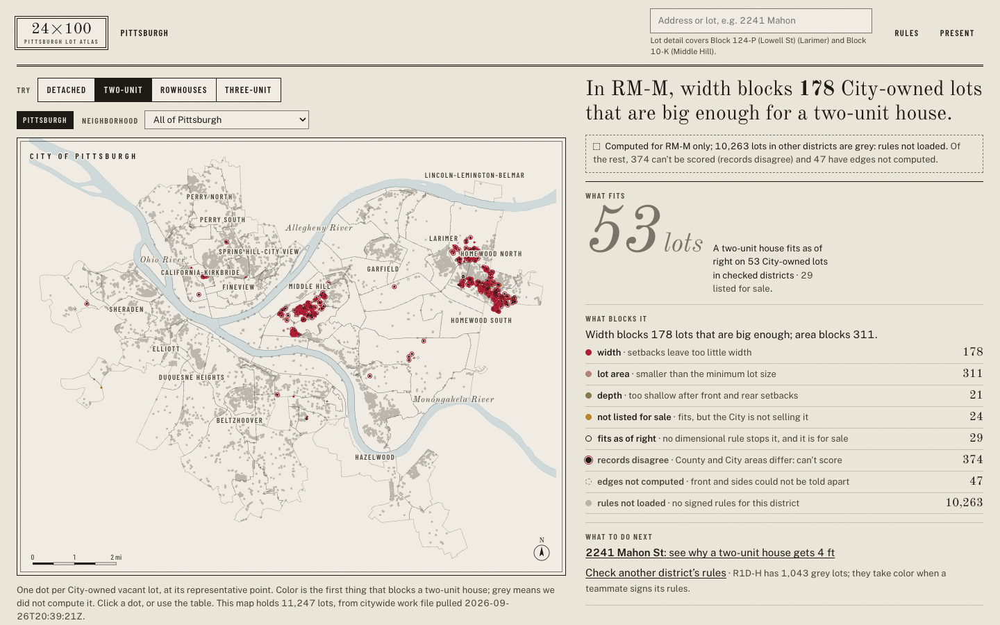
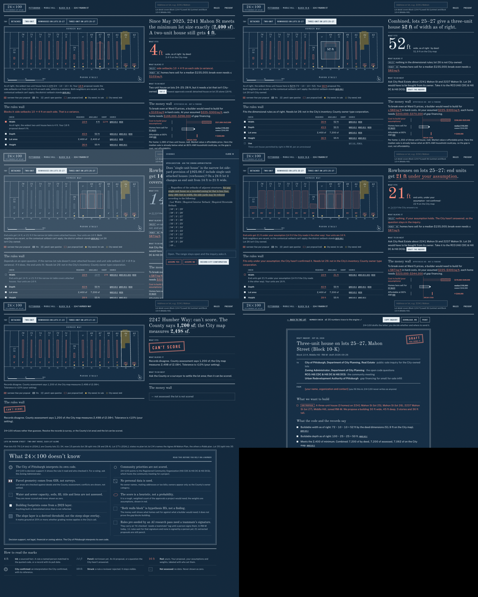
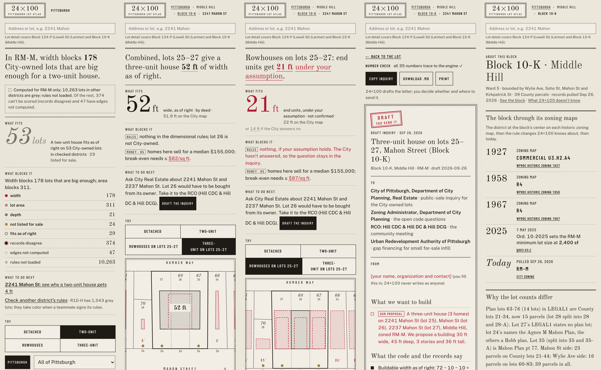

# G5 · Round 1: every screen after integration

Screens reviewed against DESIGN_GUIDE.md §12 after the four helpers' work was merged (Sat 26 Sep, evening).
Screens by helpers A and B were also reviewed by them (their notes: city, block, changes, about; review,
inquiry). This round looks at the whole app together.

**City (B02).** The full 11,247 City-owned vacant lots render; RM‑M lots are colored (Middle Hill, Homewood),
everything else is grey with the words "rules not loaded". The sentence and counts are computed live.
Defect found and fixed: the page crashed on four lots with no neighborhood in the City's data (sorting on a null
name); the build now labels them "Neighborhood not recorded" and the table sorts defensively. Defect found and
fixed in the engine: "records disagree" was checked before "rules not loaded", so districts with no rules
counted as computed; grey now wins.

**Cyanotype, desktop (B01, B04, B05, B06, B09, B10, B12).** Consistent: no Atlas brown on blue, stamps and
reds read, the drawer and the letter carry the theme. Defect: the 1910 frame house on lot 22 was still a heavy
olive block; the dark wash alpha dropped from 0.045 to 0.028.

**Phone (B02, B04, B06, B10, B12).** No horizontal scroll; plates crop to the selected lots and one neighbor
each side; targets ≥ 44 px. Defect: "Three-unit" broke at its hyphen in the type rails; non-breaking hyphens now.

**Trust.** Found by reading screens, not by tests:
- Under an assumption, other lots' 18 ft envelopes were drawn in ink hatch and the numeral said "as of right".
  Fixed: red hatch and "under your assumption · not confirmed".
- The ledger's Required column was all red. Only the proposal is red now; the 2,400 sf minimum is ink and the
  pencil parking count is pencil.
- The trust scan (`scripts/trust-scan.mjs`) then flagged ink record chips inside pencil rows. That was a scan
  that was too broad, not a UI bug: records are ink by nature. Record chips now declare their own trust.

**Words.** The letter was rewritten so the City never reads app jargon ("rule not loaded", "unreviewed"): plain
questions, human dates, a From placeholder the sender fills in.

Open after round 1: B07 and B08 wait for the R1D‑H extraction; B11 waits for the first committed refresh.
