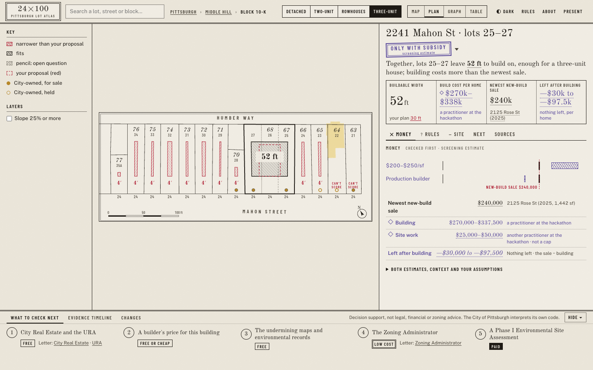
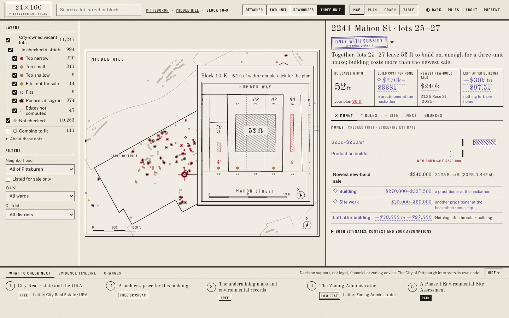
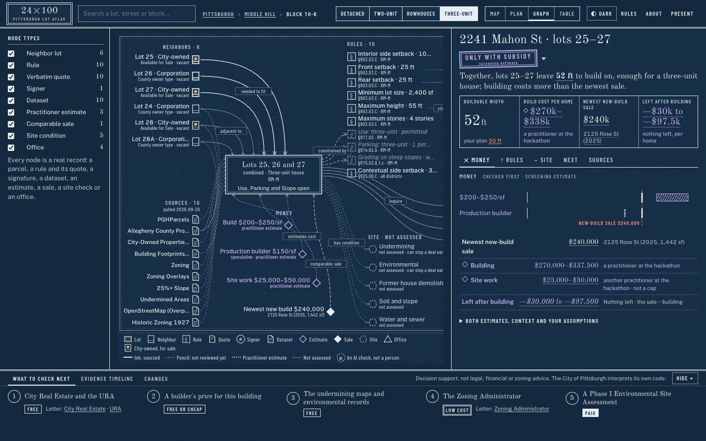

# G5 · Round 2: the workspace (spec §0.15, P0–P2)

This round reviews every screen after the rebuild into one workspace (Sun 27 Sep, early morning). The screens
were checked against `DESIGN_GUIDE.md` (§13 is the workspace section). P0 was reviewed by the helper who built
it, in `workspace-p0/`, at 1440 and 390 px, light and dark. P0–P2 together were reviewed on the production build,
in `workspace-p2/`, at 1440×900 in light and dark plus a 390 px phone. The graph has its own set in `../graph-p1/`.

**Checked on every screen:**
- It reads in 5 seconds: a status stamp, one plain sentence, then four numbers (buildable width; build cost per
  home; newest new-build sale; left after building).
- There is no page scroll at 1440×900 in light, dark or record mode. On the 390 px phone there is no sideways
  scroll.
- The word budget holds (`scripts/words.mjs`, figures counted separately; decision 49): lot 25 has 61 words in
  the header and tiles and 232 on the first screen; lots 25–27 have 60 and 232; the city 42 and 227; lot 22 46
  and 164; Larimer 69 and 239.
- The trust states are unchanged: ink, pencil (trembling), red (yours), violet (a practitioner's estimate), and
  dashed (not assessed).
- There are 0 console errors.

**Defects found and fixed in this round:**
- The map's inset plan covered its own dot, so the leader line had no length. It now takes the side with more
  room and stops short of the dot, and the line lands on the card's real height.
- On a lot, the Map canvas showed the whole city. It now zooms to the lot's neighbourhood.
- On phones, the plan's "4′" labels were swallowed by their halo, which was 3 ft wide instead of 3 screen pixels.
  The halo is now set in screen pixels.
- The graph's node-type filters rendered as a bulleted list. They now use the same rows as the map layers.
- While the city data loaded, the city view showed zeros. It now says it is loading.
- In record mode the page first scrolled 360 px (`.app { min-height: 100vh }`). Found by the P0 helper, and fixed.
- The Combine to fit sentence fell below its list on phones: a phone rule ordered every `.sentence`. Scoped.

**Open (carried to round 3, after the team's review):**
- Negative money reads "−$30k to −$97.5k" in the display serif, and there the minus looks like a dash. The words
  "nothing left" sit under it.
- Present mode isn't adapted to the workspace yet (spec §0.15 P3).
- On the phone, the cropped plan's scale bar runs past its frame. The overflow is clipped and the page doesn't
  scroll.
- The sale, ward and district filters apply to lots but not to Combine to fit runs. The neighbourhood filter
  applies to both.
