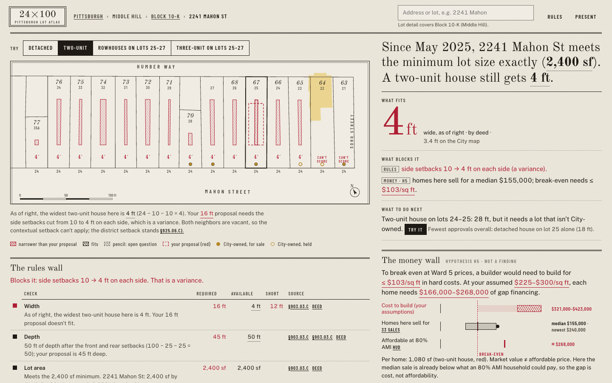
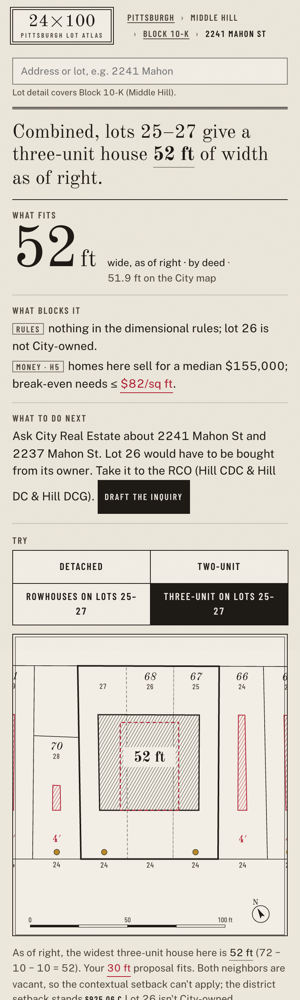

# Self-review: the signature slice (B01, B04)

Three rounds on the signature states before building wide, against DESIGN_GUIDE.md §12 and the brief's
signature moment. Screens are real renders of the app on the regenerated Block 10‑K data.

## Round 0 (first render, 1440×900 light)

What worked: every Mahon Street lot shows its own red 4 ft sliver inside a red dashed 16 ft proposal
outline; the numeral reads **4 ft** in red; the sentence rewrites from the result.

Defects found:
1. City-owned lots got a gold watercolor wash that flooded half the row; ownership should read from the coins.
2. Lot 22 (2247 Humber Way) had no labels: its address is on Humber Way, so it fell out of the "main row"
   even though it fronts Mahon Street. The refusal case was invisible on the plate.
3. Setback dimension labels ("10") collided with the proposal outline inside 50 px lots.
4. A short diagonal street (Hallett St) was labeled over the scale bar.
5. Money-wall value labels ran off the right edge; bars overflowed.
6. A long evidence button rendered as centred text (browser default for buttons).
7. A dead band under the plate: the answer column was taller than the plate column, and the walls waited.
8. Duplicate React keys for repeated rule chips.

## Round 1 (fixes, desktop and phone, both themes)

Fixes: removed the City wash (coins only); the main row is now geometric (within 45 ft of the main street
centerline), so lot 22 shows "CAN'T SCORE"; removed in-lot setback dims (the sentence and ledger carry them);
street labels only for segments ≥ 60 ft inside the frame; money bars got a value column; long evidence
segments render as text plus a section chip; each column now flows independently (rules wall under the
plate, money wall under the answers); chips de-duplicated; the rules wall names lot 26's ownership (the
brief's "the rules wall names who owns the middle lot"); passing ink rows fold their sentence into a tooltip
to keep the ledger short.

Phone: the plate now crops to the selected lots and one neighbour each side; the rail wraps into a 2×2 grid
with 44 px targets; "25–27" no longer breaks across lines.

## Round 2 (record mode, 1920×1080, both themes)

Defect: record mode applied the presentation type multiplier on top of the 1.33× zoom, pushing both walls
below the fold. Fix: record mode uses the zoom alone. Result: the signature frame (plate, 52 ft, rules wall
naming lot 26, money wall with the Ward 5 median $155,000 and the newest comparable $240,000) fits one frame.

Remaining notes carried to G5: the frame house wash on lot 22 is still heavy in Cyanotype (alpha reduced
once); plate street labels in record mode could be larger.
